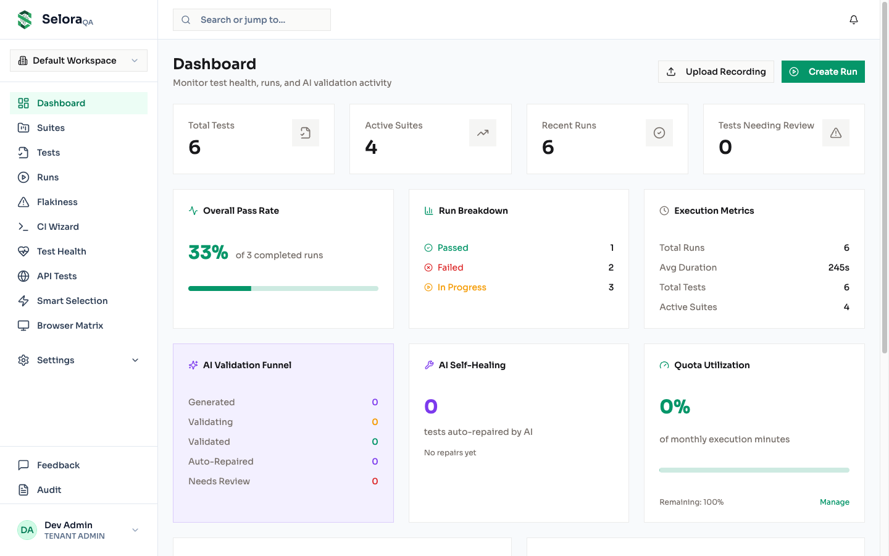
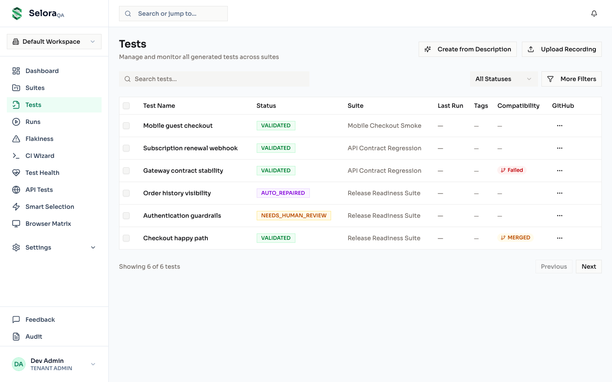
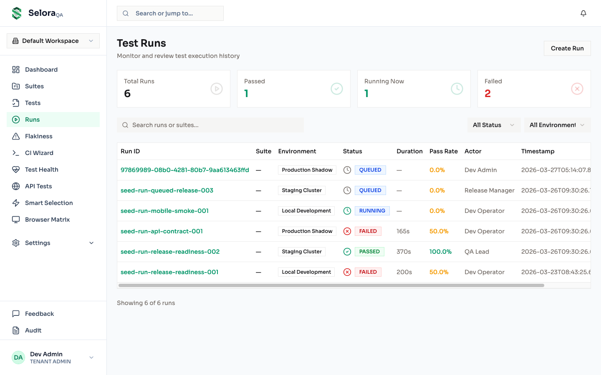
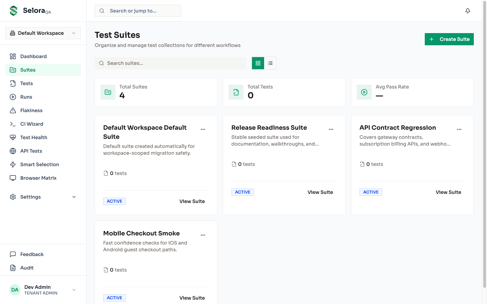
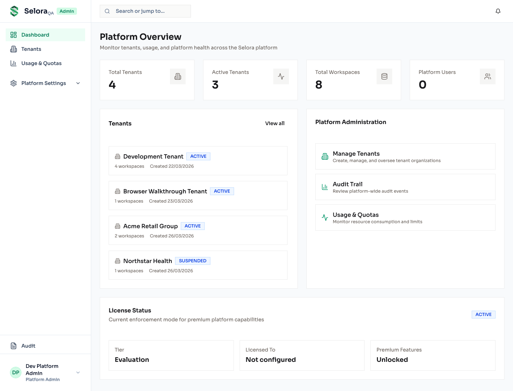
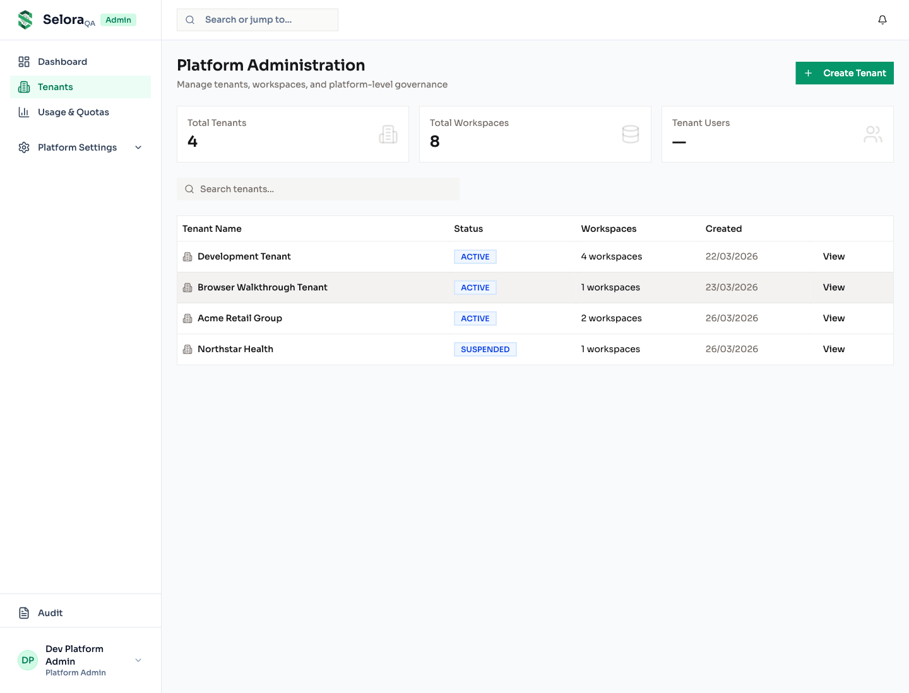
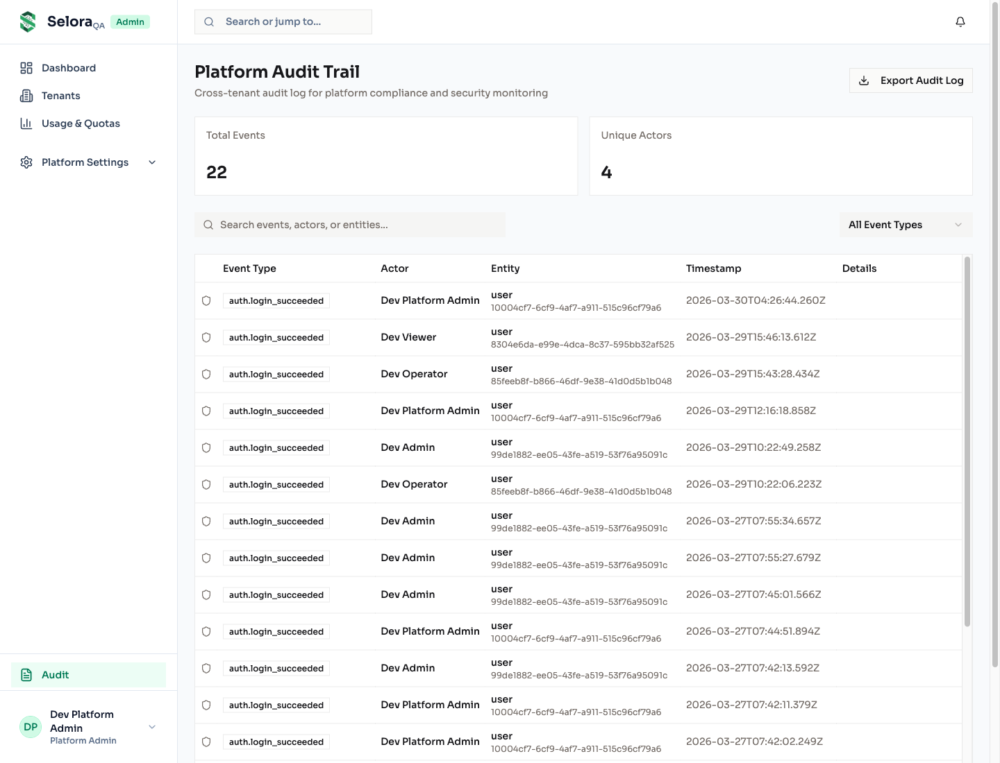
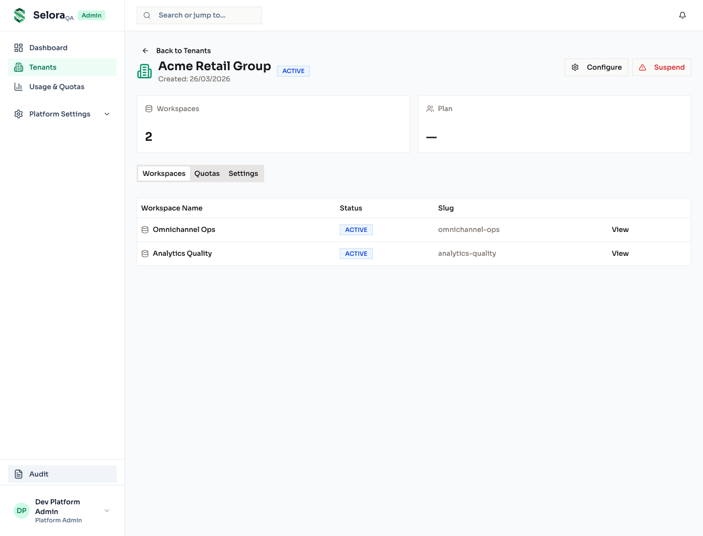

<p align="center">
  
</p>

<p align="center">
  <strong>AI-Powered QA Automation Platform</strong><br/>
  Record your browser. AI writes the tests. Self-healing keeps them green.
</p>

<p align="center">
  <a href="https://github.com/sidrat2612/selora-AI-QA/actions/workflows/ci.yml"></a>
  
  
  
  
  
  
  <a href="LICENSE"></a>
</p>

---

## The Problem

Writing and maintaining end-to-end tests is painful. Tests break when UI changes, require constant manual updates, and eat up engineering time that should go toward building features.

## The Solution

**Selora** records your Playwright browser sessions and uses AI to automatically generate, version, execute, and self-heal your test suite — so your tests never go stale.

```
🎬 Record  →  🤖 AI Generates Tests  →  ▶️ Execute  →  🔧 Auto-Repair  →  ✅ Always Green
```

## Screenshots

### Core App — Tenant Dashboard

<p align="center">
  
  
</p>

<p align="center">
  
  
</p>

### Platform Console — Admin Panel

<p align="center">
  
  
</p>

<p align="center">
  
  
</p>

---

## Features

### Core Pipeline

- **🎬 Recording-first workflow** — Upload Playwright Codegen recordings; AI handles the rest
- **🤖 AI test generation** — Recordings → versioned canonical tests → executable Playwright code
- **🔧 Bounded self-healing** — Rule-based + LLM repair (2-attempt max) with diff storage and full audit trail
- **▶️ Test execution** — On-demand runs with artifact capture (logs, screenshots, traces, video)

### Integrations

- **GitHub** — Auto-publish tests, webhook ingestion, PR lifecycle, secret rotation
- **TestRail** — Case mapping, sync dashboard, import from TestRail
- **CLI** — `@selora/cli` for init, run, repair, and sync commands

### Platform

- **📊 Observability dashboard** — Pass rates, run breakdowns, execution metrics, test health, flakiness reports
- **🔒 Multi-tenant governance** — 4-role RBAC, full audit trail, usage metering, quota enforcement
- **🧠 AI Intelligence** — Auto-repair summaries, smart test selection, visual regression detection
- **📈 Progressive rollout** — INTERNAL → PILOT → GENERAL stages with auto-promotion

---

## How Selora Compares

| Capability | Selora | Playwright (raw) | Cypress | TestRigor | Mabl |
|---|:---:|:---:|:---:|:---:|:---:|
| Record → Test generation | ✅ AI | ❌ Manual | ❌ Manual | ✅ NLP | ✅ |
| Self-healing tests | ✅ Rule + LLM | ❌ | ❌ | ✅ | ✅ |
| Repair audit trail | ✅ Full diff | ❌ | ❌ | ❌ | ❌ |
| Self-hosted | ✅ | ✅ | ✅ | ❌ SaaS | ❌ SaaS |
| GitHub native integration | ✅ | ❌ | ❌ | ❌ | ❌ |
| Multi-tenant + RBAC | ✅ | ❌ | ❌ | ✅ | ✅ |
| API test support | ✅ | ❌ | ✅ | ✅ | ✅ |
| Visual regression | ✅ | ❌ | Plugin | ✅ | ✅ |
| Open source | ✅ | ✅ | ✅ | ❌ | ❌ |

---

## Tech Stack

| Layer | Technology |
|---|---|
| **Frontend** | React 18, Vite 6, React Router 7, TanStack Query, shadcn/ui, Tailwind CSS 4, Recharts |
| **Backend** | NestJS 11, Prisma 6, PostgreSQL 16 |
| **Workers** | BullMQ (dev) / SQS (prod), Redis 7 |
| **Storage** | S3-compatible (MinIO for local dev) |
| **Infra** | Docker Compose, Terraform (AWS), CloudFront, App Runner, ECS Fargate |
| **Build** | pnpm 10 workspaces, Turborepo, TypeScript 5.7 |

---

## Quick Start

### Prerequisites

- Node.js 20+
- pnpm 10+
- Docker & Docker Compose

### Local Development

```bash
git clone https://github.com/sidrat2612/selora-AI-QA.git
cd selora-AI-QA
pnpm install
cp .env.local.example .env.local
docker compose up postgres redis minio mailpit -d
pnpm db:generate && pnpm db:migrate:dev && pnpm db:seed
pnpm dev
```

Open **http://localhost:3000** and log in with `admin@selora.local` / `admin123`.

### Full Docker Stack

```bash
docker compose up --build -d    # Builds & starts all 10 services
docker compose ps               # Verify all containers are healthy
```

---

## Project Structure

```
selora/
├── apps/
│   ├── api/                    # NestJS REST API
│   ├── selora-core/            # Tenant-facing React SPA (app.seloraqa.com)
│   ├── selora-console/         # Platform admin React SPA (console.seloraqa.com)
│   ├── worker-execution/       # Playwright test runner worker
│   ├── worker-ingestion/       # Recording ingestion & AI canonicalization
│   └── worker-ai-repair/       # Rule-based + LLM repair worker
├── packages/
│   ├── database/               # Prisma schema (40+ models), migrations, seed
│   ├── auth/                   # Session auth, hashing, tokens
│   ├── storage/                # S3/MinIO abstraction
│   ├── queue/                  # BullMQ + SQS dual-mode queues
│   ├── executor/               # Playwright test runner
│   ├── test-generator/         # AI code generation
│   ├── ai-repair/              # AI repair pipeline
│   ├── canonical-tests/        # Canonical test schema & parsing
│   ├── recording-ingest/       # Recording file processing
│   ├── cli/                    # Command-line interface
│   └── ...                     # audit, observability, domain, test-validator
├── infrastructure/
│   ├── docker/                 # Production Dockerfiles
│   └── terraform/              # AWS infrastructure (17 .tf files)
├── docker-compose.yml          # Local dev stack (10 services)
└── turbo.json                  # Build pipeline
```

---

## Commands

| Command | Description |
|---|---|
| `pnpm dev` | Start all services in dev mode |
| `pnpm build` | Build all packages |
| `pnpm typecheck` | Type-check the entire monorepo |
| `pnpm lint` | Lint all packages |
| `pnpm test` | Run tests |
| `pnpm format` | Format with Prettier |
| `pnpm db:studio` | Open Prisma Studio |
| `pnpm db:seed` | Seed the database |

---

## Environment Variables

Copy `.env.local.example` and configure:

| Variable | Required | Description |
|---|---|---|
| `DATABASE_URL` | Yes | PostgreSQL connection string |
| `REDIS_URL` | Production | Redis connection for queues |
| `WEB_ORIGIN` | Production | CORS allowed origin |
| `ENCRYPTION_KEY` | Production | Secret encryption key |
| `LLM_API_KEY` | Production | AI provider API key |
| `S3_BUCKET` | Recommended | Artifact storage bucket |

See [`.env.production.example`](.env.production.example) for full production config.

---

## Documentation

- 📐 [Architecture & Tech Stack](docs/ARCHITECTURE.md) — System design, data flows, infrastructure
- 🚀 [Deployment Guide](docs/DEPLOYMENT.md) — Terraform setup, AWS deployment, CI/CD
- 🤝 [Contributing](CONTRIBUTING.md) — Development setup, code style, PR guidelines

---

## Contributing

Contributions are welcome! Please read the [Contributing Guide](CONTRIBUTING.md) before submitting a PR.

```bash
pnpm turbo typecheck && pnpm lint && pnpm turbo build
```

---

## License

Licensed under the GNU Affero General Public License v3.0. See [LICENSE](LICENSE) for details.

---

<p align="center">
  Built by <a href="https://github.com/sidrat2612">Siddharth Rathore</a>
</p>
